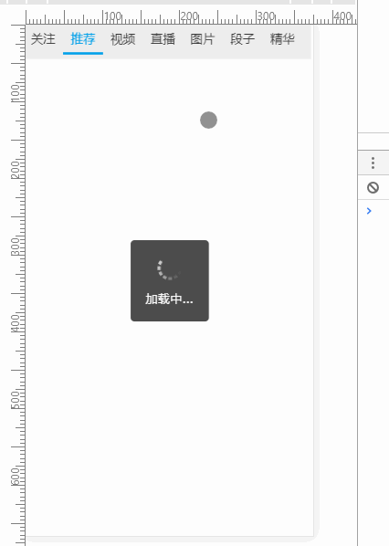

# newnet_admin

> new vuejs project
> 该项目使用的是在vue-cli基础上，增加:
>1. vuex
>2. iview
>3. vee-validate
>4. aixos
>5. 接口跨域解决
## Build Setup

``` bash
# install dependencies
npm install

# serve with hot reload at localhost:8080
npm run dev

# build for production with minification
npm run build

# build for production and view the bundle analyzer report
npm run build --report

# run unit tests
npm run unit

# run e2e tests
npm run e2e

# run all tests
npm test
``` 
##*项目相关图片展示*
1.  

For detailed explanation on how things work, checkout the [guide](http://vuejs-templates.github.io/webpack/) and [docs for vue-loader](http://vuejs.github.io/vue-loader).
